### These procedure steps will be followed on the simulator

1. When you click on Identification of Minerals file, a new window will open, Click Next to proceed. 
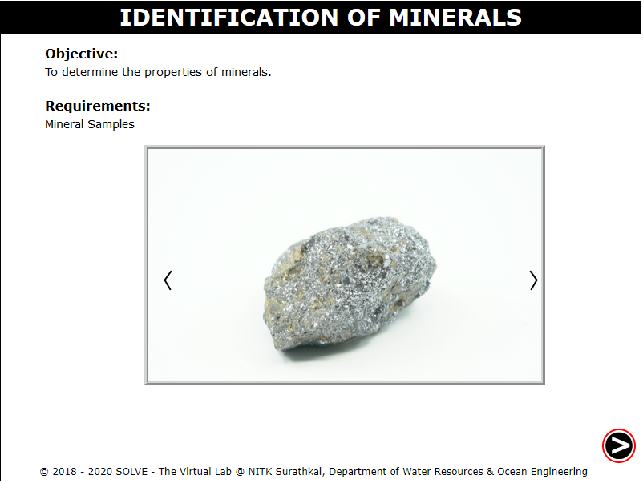 

2. Click on the Next button on the slide show of the minerals to select the mineral for identification, click OK, Click Next. 
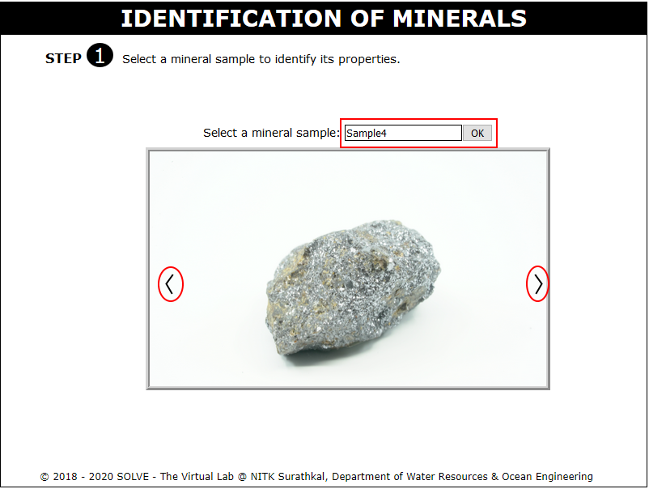 

3. Click on Mineral in the menu to view the selected mineral in multiple views and to get a zoomed view. 
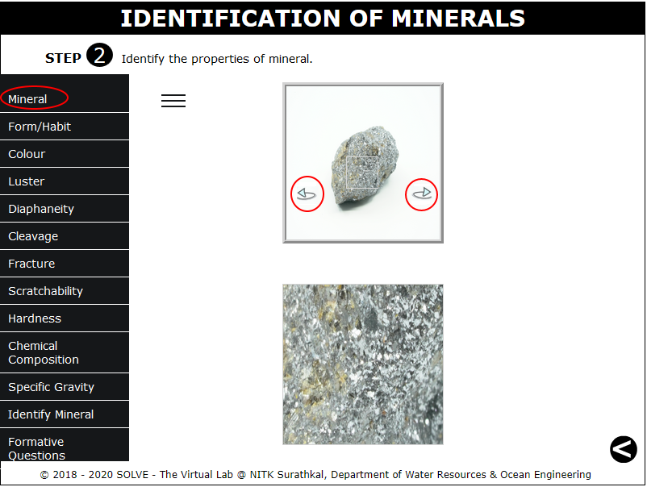 

4. Click on Form/Habit in the menu and select the form of the selected mineral by checking on the checkbox. Click on Check Answer, Reset Answer or Get Correct Answer buttons available. 
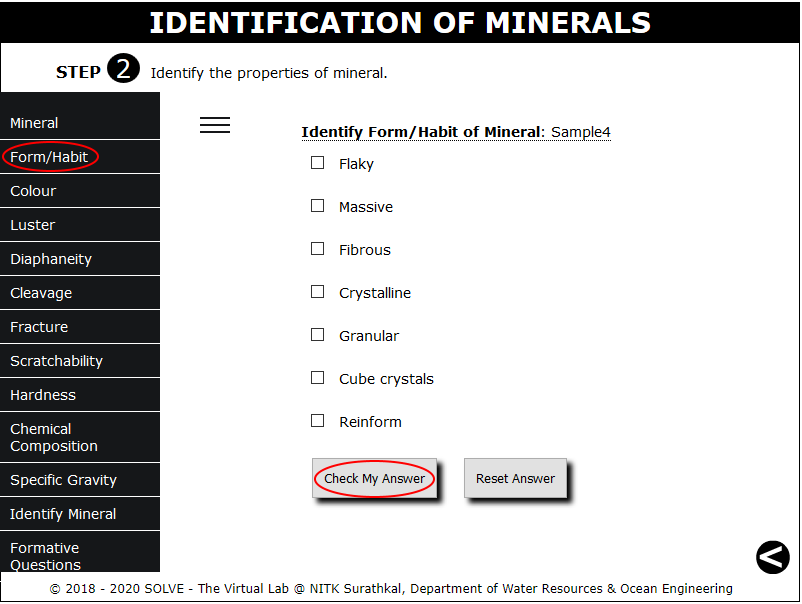 

5. Click on Colour in the menu and select the possible colours of the selected mineral by checking on the checkbox. Click on Check Answer,  Reset Answer or Get Correct Answer buttons available. 
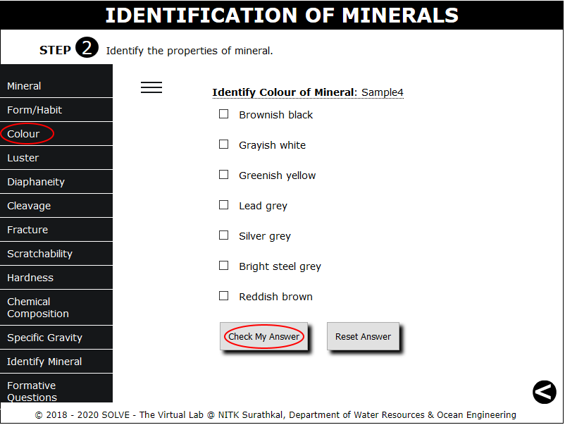 

6. Click on Luster in the menu and select the Luster of the mineral by clicking on the radio button. Click on Check Answer, Reset Answer or Get Correct Answer buttons available. 
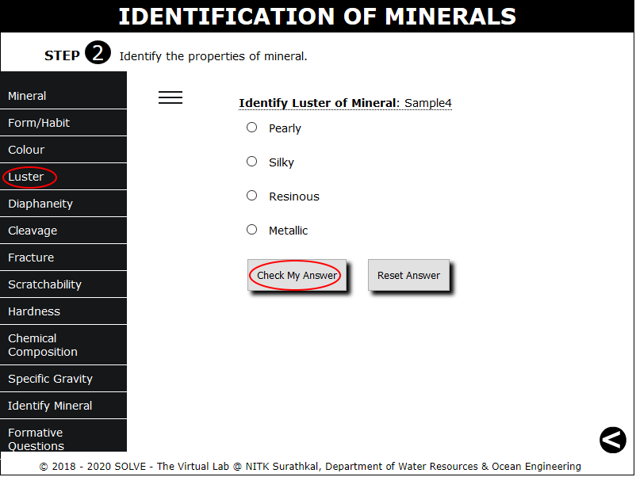 

7. Click on Diaphaneity in the menu and select whether mineral is opaque or translucent by clicking on the radio button. Click on Check Answer, Reset Answer or Get Correct Answer buttons available. 
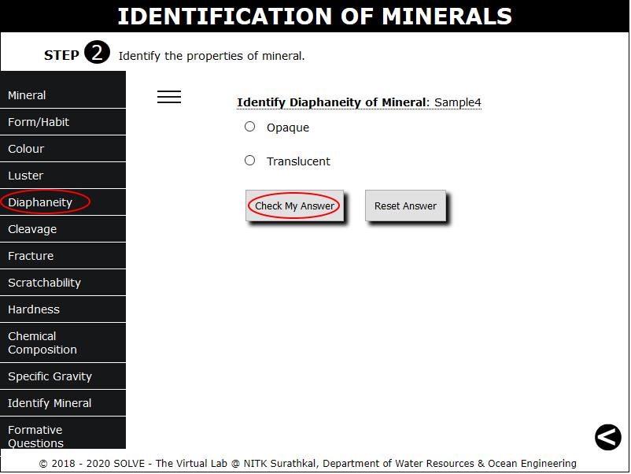 

8. Click on Cleavage in the menu and select the possible cleavage properties of the selected mineral by checking on the checkbox. Click on Check Answer, Reset Answer or Get Correct Answer buttons available. 
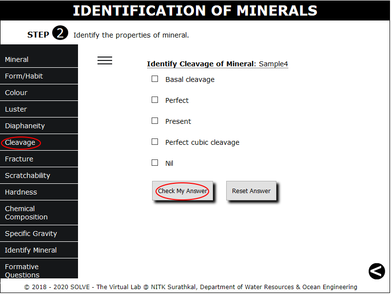 

9. Click on Fracture in the menu and select the property of the selected mineral by clicking on the radio button. Click on Check Answer, Reset Answer or Get Correct Answer buttons available. 
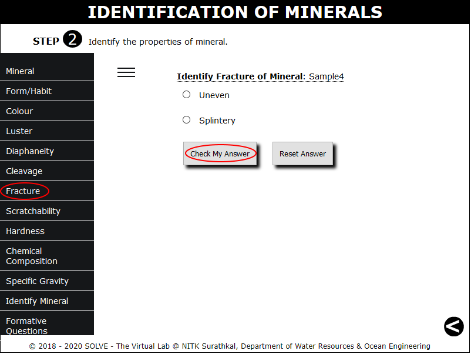 

10. Click on Scratchability in the menu and select the property of the selected mineral by clicking on the radio button. Click on Check Answer, Reset Answer or Get Correct Answer buttons available. 
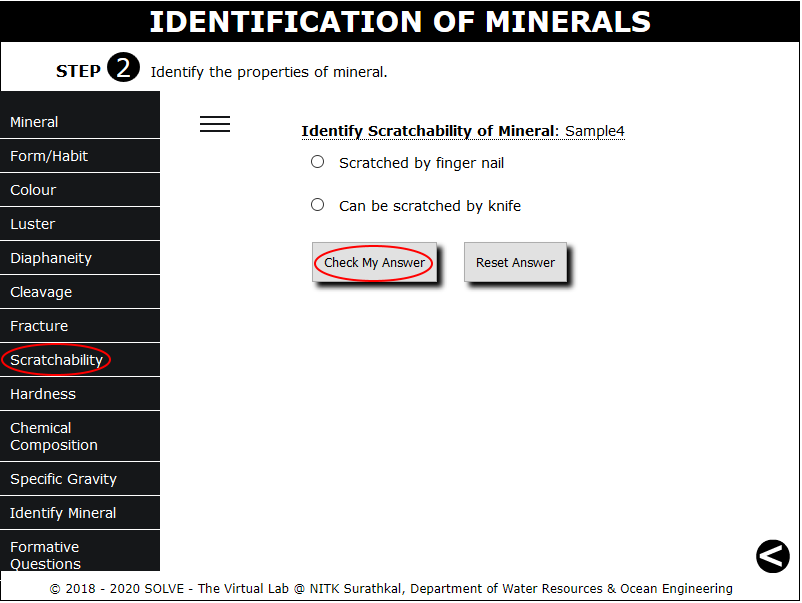 

11. Click on Hardness in the menu and select the Hardness of the selected mineral by clicking on the radio button. Click on Check Answer, Reset Answer or Get Correct Answer buttons available. 
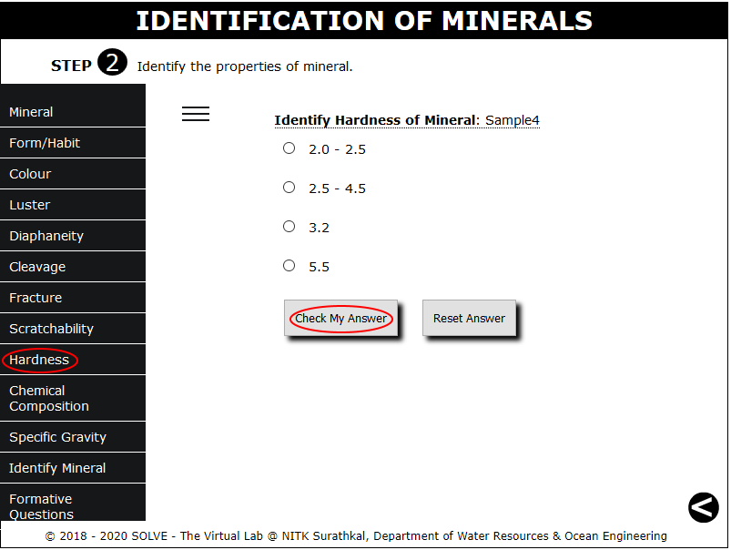 

12. Click on Chemical Composition in the menu and select chemicsl formula of the selected mineral by clicking on the radio button. Click on Check Answer, Reset Answer or Get Correct Answer buttons available. 
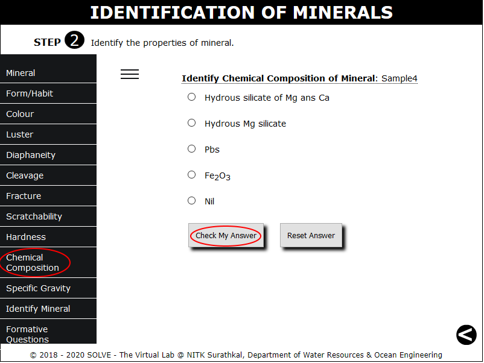 

13. Click on Specific Gravity in the menu and select the correct answer for the selected mineral by clicking on the radio button. Click on Check Answer, Reset Answer or Get Correct Answer buttons available. 
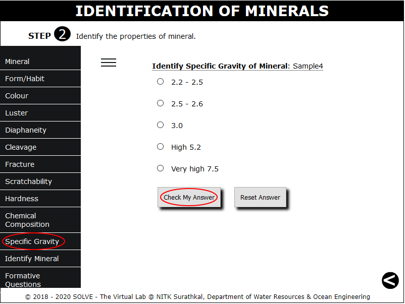 

14. Click on Identify Mineral in the menu to view the properties that got skipped during the process and finally identify the mineral name from the features identified. 
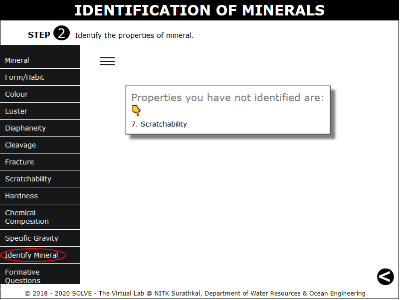 

15. Click on Formative Questions to answer the questions dispalyed and click on the previous button displayed in the bottom right corner to select other sample. 
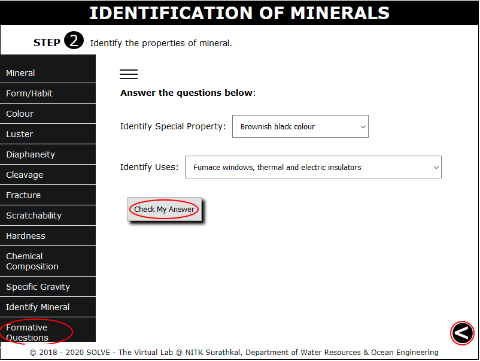 
